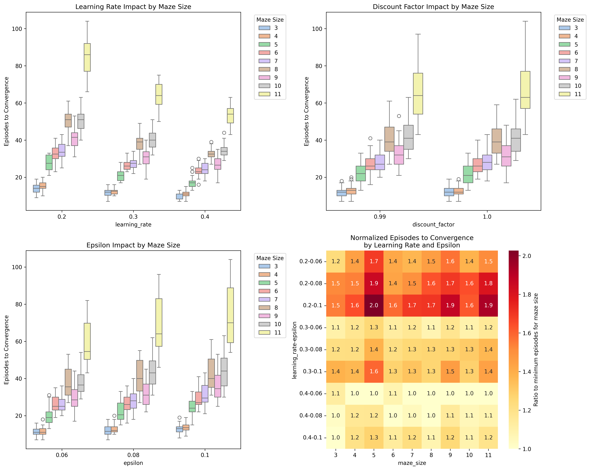
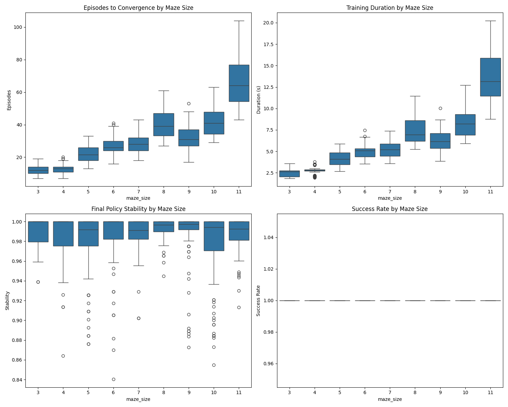
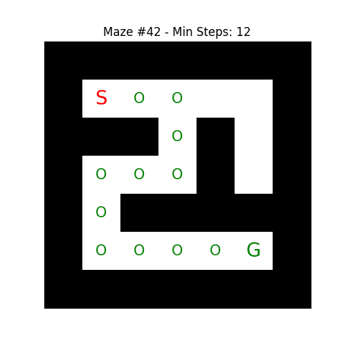
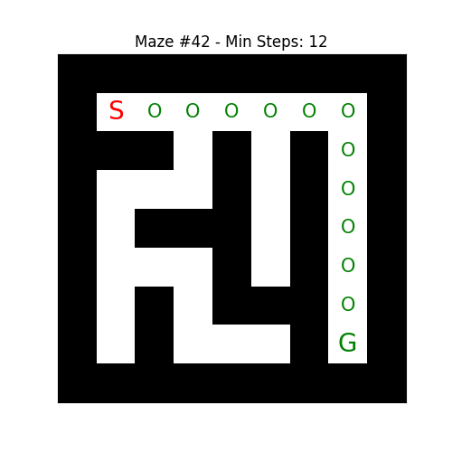
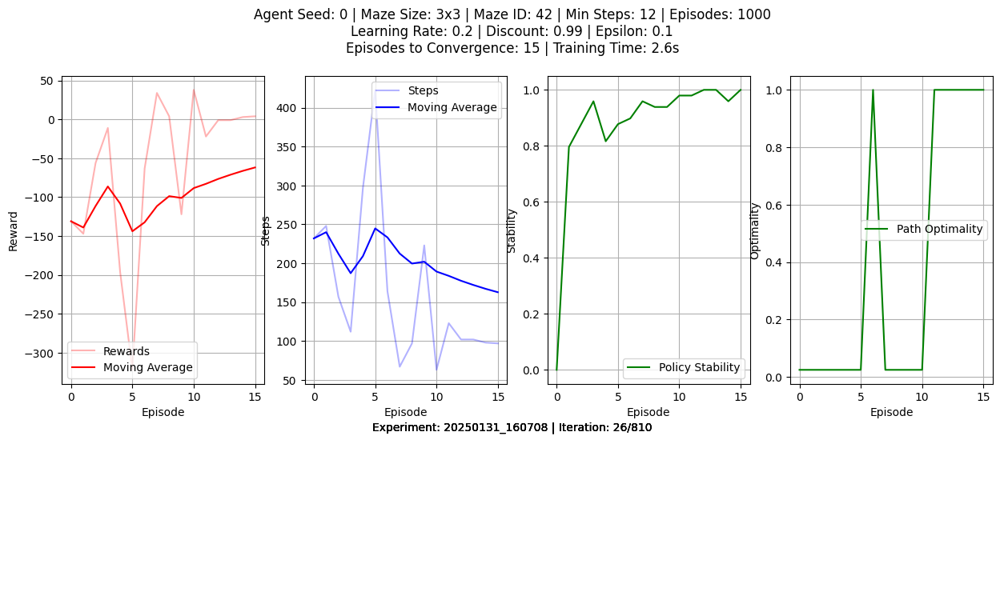
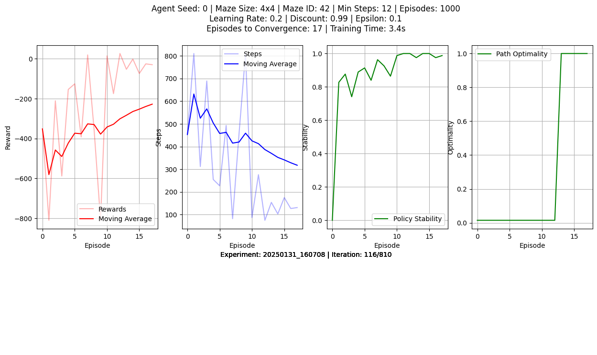

# Q-Learning Maze Navigation System Documentation

## Environement set up details

```
pipx install uv
uv venv
uv pip install -r requirements.txt
```

## Class Overview

### Config

```python
@dataclass
class Config:
    """Configuration parameters for maze navigation system"""
    # Maze parameters
    maze_size: int = 5  # Grid dimensions (nxn)
    maze_id: Optional[int] = None  # Seed for reproducible maze generation
    
    # Algorithm parameters 
    learning_rate: float = 0.1  # Step size α ∈ (0, 1]
    discount_factor: float = 0.9  # γ for future rewards
    epsilon: float = 0.1  # Exploration rate
    num_episodes: int = 100  # Training episodes
    agent_seed: int = None  # For reproducible training

    # Reward structure
    goal_reward: float = 100  # Reward for reaching end
    wall_penalty: float = -10  # Penalty for invalid moves
    step_penalty: float = -1  # Per-step penalty

    # Training parameter
    optimal_path_convergence_window: int = 5  # Episodes to confirm convergence
```

### MazeEnvironment

```python
class MazeEnvironment:
    """Handles maze generation, state management and visualization"""
    
    Properties:
    - grid: np.array  # Binary maze representation (0=path, 1=wall)
    - start: tuple  # Starting position (1,1)
    - end: tuple  # Goal position (height-2, width-2)
    - optimal_path: List[Tuple]  # Shortest solution path
    - optimal_path_length: int  # Length of shortest path
    
    Methods:
    - generate()  # Creates new maze using Sidewinder algorithm
    - get_state(position)  # Returns current state representation
    - get_reward(state, next_state)  # Calculates reward for transition
    - is_valid_move(state)  # Checks if move is legal
    - visualize(path, show_optimal, save_path)  # Displays/saves maze visualization
    - get_minimum_steps()  # Returns optimal path length
```

### QLearningAgent

```python
class QLearningAgent:
    """Implements Q-learning algorithm"""
    
    Properties:
    - q_table: np.array  # Shape (height, width, 4) for action values
    - actions: List[Tuple]  # Up, Down, Left, Right as (row_change, col_change)
    - exploration_rate: float  # Current ε value
    
    Methods:
    - get_action(state, training)  # Selects action using ε-greedy policy
    - update(state, action, reward, next_state)  # Updates Q-value
```

### AgentControl

```python
class AgentControl:
    """Manages training, testing and metrics"""
    
    Properties:
    - metrics: Dict  # Training/testing metrics including:
        - rewards, steps, success_rate, episode_status
        - training_duration, path_lengths
        - policy_stability, path_optimality_test
        - episodes_to_convergence
    
    Methods:
    - calculate_policy_stability()  # Measures policy stability
    - run_episode(training)  # Runs single episode
    - train(save_path, experiment_id, iteration_count)  # Trains with visualization
    - test(display)  # Tests trained agent
    - test_consistency(num_tests)  # Multiple test runs
```

### MazeExperiments

```python
class MazeExperiments:
    """Manages maze learning experiments with comprehensive tracking"""
    
    Methods:
    - run_experiment(maze_sizes, param_grid, trials)  # Run experiments across configurations
    - analyze_results(experiment_dir)  # Analyze and visualize results
    - _generate_analysis(results, metadata, save_path)  # Generate comprehensive analysis
    - _plot_convergence_analysis(df, save_path)  # Plot convergence metrics
    - _plot_parameter_impact(df, save_path)  # Plot parameter effects
    - _generate_summary_report(df, metadata, save_path)  # Generate detailed report
```

## Example Usage

### Basic Training

```python
# Configure the environment and agent
config = Config(
    maze_size=5,
    learning_rate=0.1,
    discount_factor=0.9,
    epsilon=0.1,
    num_episodes=100
)

# Create environment and agent
env = MazeEnvironment(config)
agent = QLearningAgent(env, config)
control = AgentControl(env, agent, config)

# Train the agent
control.train()

# Test the trained agent
control.test(display=True)
```

### Running Experiments

```python
# Configure parameter grid
param_grid = {
    'learning_rate': [0.2, 0.3, 0.4],
    'discount_factor': [1.0, 0.99],
    'epsilon': [0.06, 0.08, 0.1],
    'num_episodes': 1000,
    'maze_id': 42  # Optional: fixed maze for reproducibility
}

# Create and run experiments
experiments = MazeExperiments()
experiment_dir = experiments.run_experiment(
    maze_sizes=[3, 4, 5, 6, 7, 8],
    param_grid=param_grid,
    trials=5
)

# Analyze results
experiments.analyze_results(experiment_dir)
```

## Example output

The example are from this experiment configuration

```
param_grid = {
    'learning_rate': [0.2, 0.3, 0.4],
    'discount_factor': [1.0, 0.99],
    'epsilon': [0.06, 0.08, 0.1],
    'num_episodes': 1000,
    'maze_id': 42  # Optional: fixed maze for reproducibility
}

experiments = MazeExperiments()
experiment_dir = experiments.run_experiment(
    maze_sizes=[3, 4, 5, 6, 7, 8, 9, 10, 11],
    param_grid=param_grid,
    trials=5
)
experiments.analyze_results(experiment_dir)
```

### Summary Report

This report lists the top performing hyperparameters.

[Summary Report](/experiments/Example_20250131_160708/analysis/summary_report.md)

### Consolidated view of parameters impact




### Consolidated view of convergence metrics




### Mazes to solve (with their optimal paths) 

These are example mazes for the seed 42 (of course!)

#### 3x3 



#### 4x4




### Example training outputs

#### 3x3



#### 4x4

